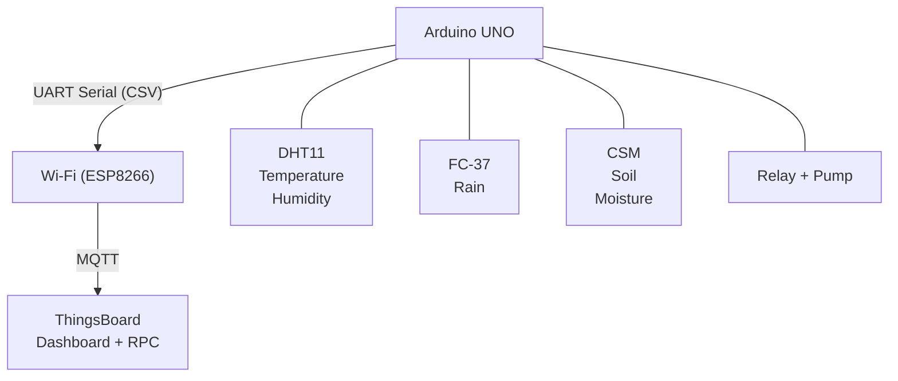
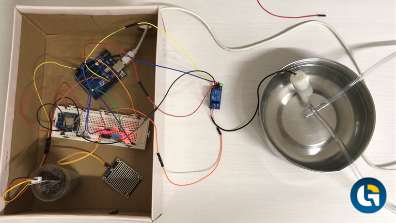
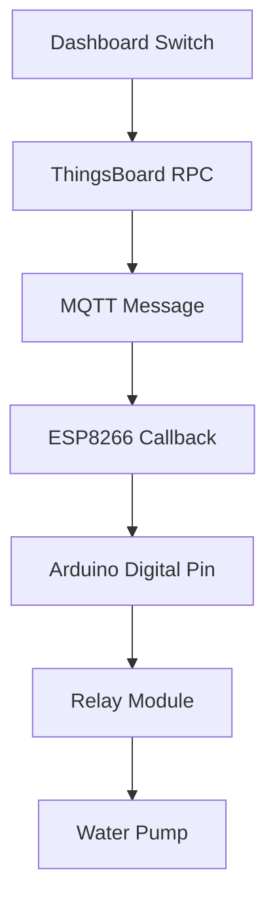
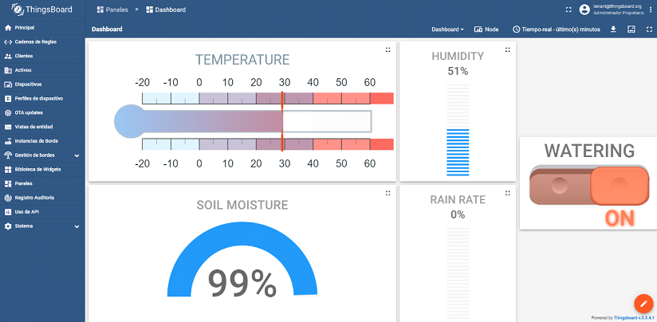
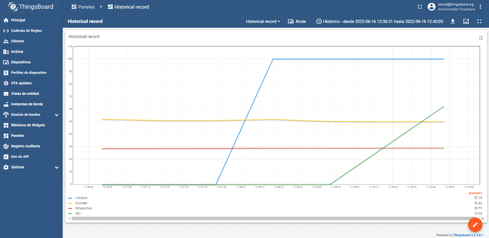

# 🌱 IoT Irrigation System

> An IoT-based smart irrigation system built with **Arduino UNO**, **ESP8266**, and **ThingsBoard** that enables remote monitoring of environmental conditions and real-time irrigation control.

---

## Overview

This project implements a complete end-to-end IoT solution for smart irrigation in urban gardens and small agricultural environments.

The system continuously monitors environmental and soil conditions through multiple sensors, publishes telemetry to a ThingsBoard server using MQTT, and allows users to remotely control irrigation from a web dashboard.

Unlike traditional timer-based irrigation systems, this solution provides real-time visibility into environmental conditions, allowing irrigation decisions to be made based on actual data instead of fixed schedules.

---

## Features

- 📡 Real-time telemetry acquisition
- 🌡️ Ambient temperature monitoring
- 💧 Ambient humidity monitoring
- 🌱 Soil moisture monitoring
- 🌧️ Rain detection
- 🚰 Remote irrigation control
- 📈 Historical data visualization
- 📱 Web dashboard for monitoring and management
- 🔌 MQTT communication with ThingsBoard
- ⚡ Modular architecture for future expansion

---

# Architecture



---

# Hardware

| Component | Purpose |
|-----------|----------|
| Arduino UNO | Main controller |
| ESP8266 | Wi-Fi connectivity |
| DHT11 | Temperature and ambient humidity |
| FC-37 Rain Sensor | Rain detection |
| Capacitive Soil Moisture Sensor | Soil humidity measurement |
| Relay Module | Pump switching |
| 5V Water Pump | Irrigation actuator |
| Breadboard + Jumper Wires | Prototype assembly |

### Prototype


---

# Software Stack

- Arduino IDE
- C++
- ESP8266 Libraries
- MQTT
- UART Serial Communication
- ThingsBoard
- PostgreSQL

---

# System Design

The project is divided into two independent components.

## 1. IoT Node

Responsible for:

- Reading all sensors
- Formatting telemetry
- Sending data to the ESP8266
- Executing irrigation commands

### Sensor Reading

The Arduino periodically reads:

- Temperature
- Ambient humidity
- Soil moisture
- Rain intensity

The collected values are serialized into a CSV message and transmitted through UART.

---

## 2. Communication Layer

Communication between the Arduino UNO and the ESP8266 is performed using UART at **9600 baud**.

The ESP8266:

- Connects to the local Wi-Fi network
- Connects to the MQTT broker
- Parses incoming CSV data
- Publishes telemetry to ThingsBoard
- Listens for RPC commands

---

## 3. Cloud Platform

ThingsBoard is used as the IoT platform.

It provides:

- Device management
- Telemetry storage
- Dashboard creation
- Historical data
- Remote Procedure Calls (RPC)

The current implementation deploys ThingsBoard locally together with PostgreSQL.

---

# Remote Irrigation

Irrigation is controlled from a dashboard switch.

The workflow is:



This architecture allows irrigation to be activated or stopped remotely from anywhere with Internet access.

---

# Dashboard



The dashboard displays:

- Current temperature
- Ambient humidity
- Soil moisture
- Rain level
- Irrigation status

Additionally, historical charts allow users to analyze environmental conditions over time and make better irrigation decisions.



---

# Communication Protocol

## Arduino → ESP8266

Telemetry is transmitted as CSV through UART.

Example:

```text
temperature,humidity,rain,moisture
24.7,63,0,78
```

The ESP8266 parses each field and uploads it individually to ThingsBoard.

---

## ESP8266 → Arduino

Irrigation commands are received through ThingsBoard RPC over MQTT.

When the dashboard switch changes:

1. ThingsBoard sends an RPC request.
2. ESP8266 receives the request.
3. ESP8266 updates a digital output.
4. Arduino activates or deactivates the relay.

---

# Installation

## Requirements

- Arduino IDE
- ESP8266 Board Package
- ThingsBoard
- PostgreSQL
- Wi-Fi network

---

## Clone the repository

```bash
git clone https://github.com/gonzalofergar/iot-irrigation-system.git
cd smart-irrigation
```

---

## Upload the firmware

### Arduino

Upload the Arduino sketch to the Arduino UNO.

### ESP8266

Configure:

- Wi-Fi SSID
- Wi-Fi password
- MQTT server
- Device token

Upload the firmware.

---

## Start ThingsBoard

Start:

- PostgreSQL
- ThingsBoard

Open:

```
http://localhost:8080
```

Create a device and obtain its access token.

---

# Future Improvements

Some ideas for future iterations include:

- PCB design instead of breadboard
- Custom embedded board
- ESP32 migration
- OTA firmware updates
- Automatic irrigation algorithms
- Weather forecast integration
- Solar-powered node
- Battery management
- Low-power operation
- Cloud deployment
- Multi-node support
- Mobile application
- Push notifications
- AI-assisted irrigation recommendations

---

# Project Status

**Current status:** Prototype

The prototype successfully demonstrates:

- Sensor acquisition
- Wireless telemetry
- MQTT communication
- Remote irrigation
- Historical visualization
- Complete IoT workflow

---

# Learning Outcomes

This project explores several IoT concepts, including:

- Embedded systems
- Sensor integration
- MQTT
- UART communication
- Remote Procedure Calls
- IoT dashboards
- Edge-to-cloud communication
- Hardware/software integration

---

# Author

**Gonzalo Fernández García**

Software Engineer
